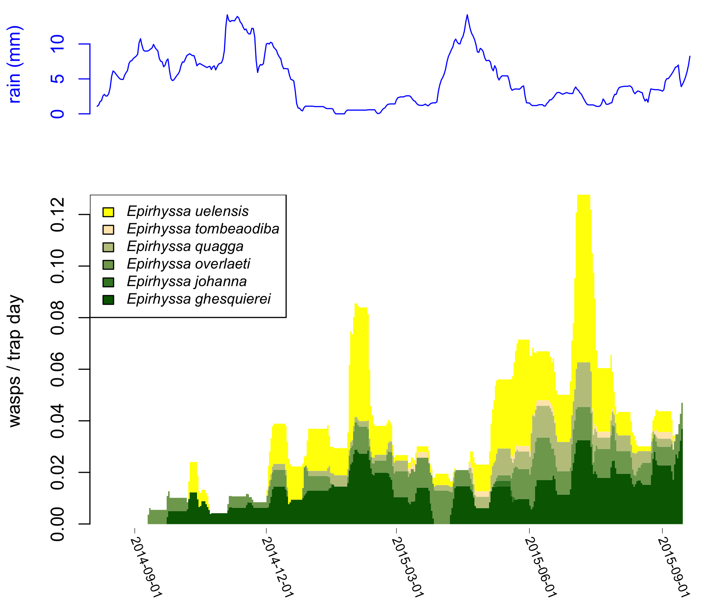

# turkuwasps

R package for use at the [Zoological Museum of the University of Turku](https://collections.utu.fi/en/zoological-museum/). For analysing the ecology and taxonomy of the wasps collected by Malaise trapping in [Uganda 2014-2015](https://doi.org/10.5281/zenodo.2225643) and [Peru 1998-2011](https://doi.org/10.5281/zenodo.3559054).

Takes the data of (typically) one subfamily of wasps, and can then:
- plot when and where in the forest they flew
- analyse how the weather and forest type affected each species' catch
- help visualise which species resemble each other
- create a preliminary identification key
- create preliminary species descriptions


## Installation

You can install the development version of turkuwasps from [GitHub](https://github.com/) with:

``` r
# install.packages("devtools")
devtools::install_github("tapani-hopkins/turkuwasps")
```

## Usage
More usage examples to come, package is still under construction.

### Load package and read data

``` r
# load the package
library(turkuwasps)
```
``` r
# get example wasp data
f = system.file("extdata", "wasps_example.csv", package = "turkuwasps", mustWork = TRUE)
wasps = read_wasps(f)

# get wasps and samples which can be used in ecological analyses
# (e.g. damaged samples and their wasps removed)
tmp = ecology_usable(wasps)
x = tmp$wasps
m = tmp$samples
```

### Show where wasps were caught

``` r
# show wasps caught in each forest type
plot_place(x$forest_type)

# show wasps caught by each trap, scaled by sampling effort
plot_place(x$trap, m, ylab="Wasps / trap day")

# add legend
default_legend("forest_type", "Uganda 2014-2015")

# you can also show each species separately
plot_place(x$forest_type, m, taxon=x$taxon)
```

### Show when wasps were caught



``` r
# store when each wasp was caught
xdate = as.interval(x$start, x$end)

# show when wasps were caught
plot_time(xdate)

# show when wasps were caught, split by species and scaled by sampling effort
plot_time(xdate, m, taxon=x$taxon, ylab="wasps / trap day")

# add legend
default_legend(x$taxon, x="topleft")
```


