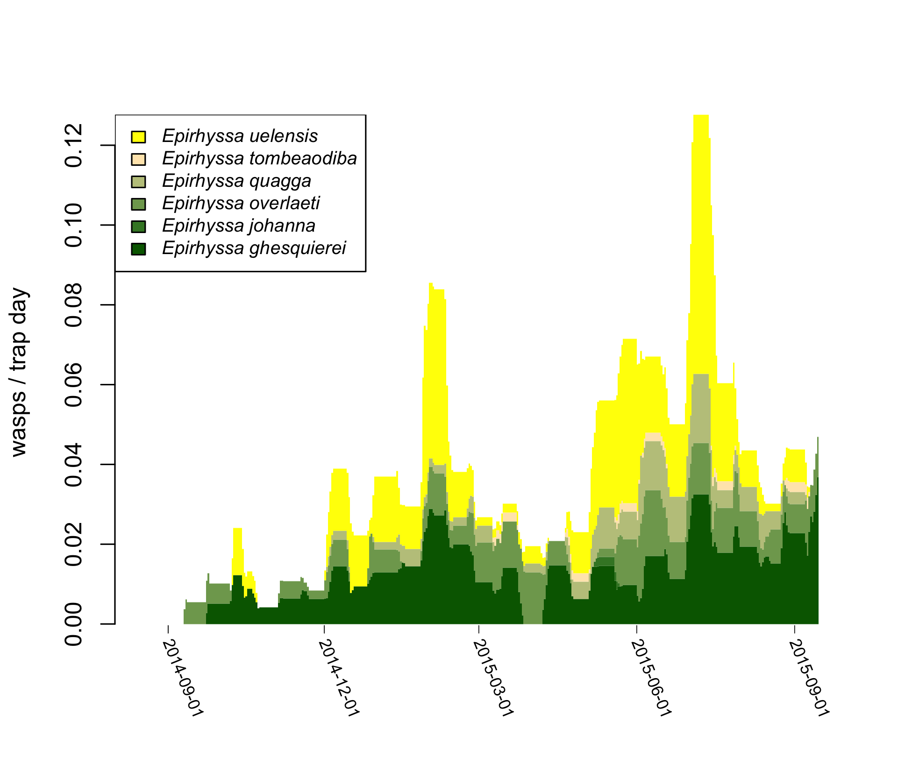
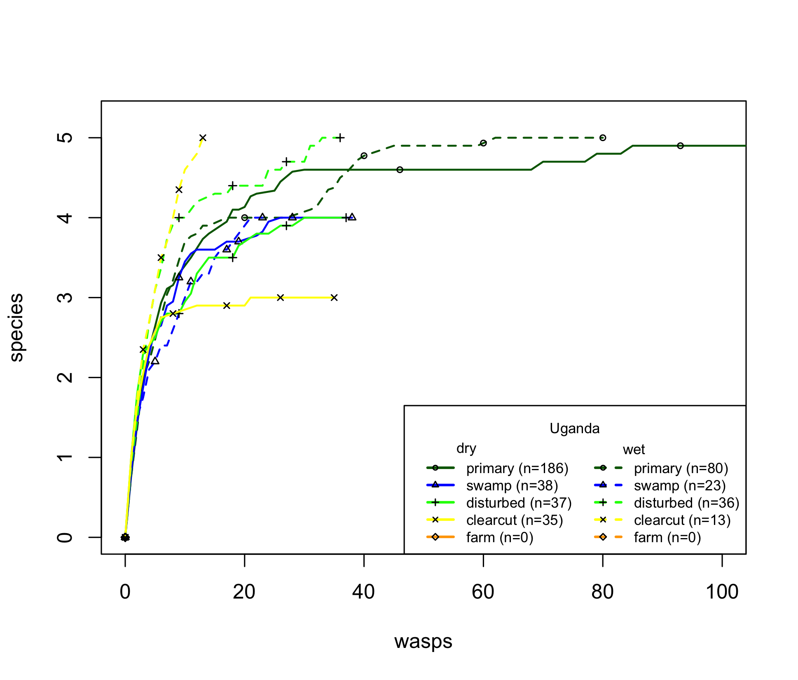

# turkuwasps

R package for use at the [Zoological Museum of the University of Turku](https://collections.utu.fi/en/zoological-museum/). For analysing the ecology, taxonomy and diversity of the wasps collected by Malaise trapping in [Uganda 2014-2015](https://doi.org/10.5281/zenodo.2225643) and [Peru 1998-2011](https://doi.org/10.5281/zenodo.3559054), and the wasps collected by Malaise trapping and light trapping in Skanssi, Finland 2024.


## Current status 

Takes the data of (typically) one subfamily of wasps, and can then:
- plot when and where in the forest they flew
- analyse how the weather and forest type affected each species' catch
- show how species accumulated and compare the species richness of sites

The data typically comes from the [Finnish Biodiversity Information Facility](https://laji.fi/en). It is downloaded in "Kotka" format via the Kotka Collection Management System.

## Future updates

Currently, there is preliminary code for calculating an evenness index. This can be used to see if the species accumulations could have been affected by differences in species abundances. In the future, this will likely be integrated with the rarefaction curves.

Future updates may include the ability to:
- create a preliminary identification key
- create preliminary species descriptions


## Installation

You can install the development version of turkuwasps from [GitHub](https://github.com/) with:

``` r
# install.packages("devtools")
devtools::install_github("tapani-hopkins/turkuwasps")
```

Alternatively, you can download the entire folder and install with:

``` r
install.packages("PATH_TO_FOLDER", repos=NULL, type="source")
```

## Usage
More usage examples to come, package is still under construction.

### Load package and read data

``` r
# load the package
library(turkuwasps)

# get path to example wasp data (csv file from Kotka)
f = system.file("extdata", "wasps_example.csv", package = "turkuwasps", mustWork = TRUE)

# read the wasp data and get the corresponding sample data
tmp = read_wasps(f)
x = tmp$x
m = tmp$m
```

### Show where wasps were caught


``` r
# show wasps caught in each forest type
plot_place(x$forest_type)

# show wasps caught by each trap, scaled by sampling effort
plot_place(x$trap, m, ylab="Wasps / trap day")

# add legend
default_legend("forest_type", "Uganda 2014-2015")

# you can also show each species separately
plot_place(x$forest_type, m, taxon=x$taxon)
```

### Show when wasps were caught



``` r
# store when each wasp was caught
xdate = as.interval(x$start, x$end)

# show when wasps were caught
plot_time(xdate)

# show when wasps were caught, split by species and scaled by sampling effort
plot_time(xdate, m, taxon=x$taxon, ylab="wasps / trap day")

# add legend
default_legend(x$taxon, x="topleft")
```

### Show the weather when wasps were caught


```r
# prepare layout (two plots)
layout(matrix(1:2), heights=c(1, 3))

# get x limits that cover the wasp data
xlim = plot_time(as.interval(x$start, x$end), plot=FALSE, xlabel=FALSE)$xlim

# draw rain plot
par(mar=c(1.5, 4.1, 0.5, 0.1))
plot_weather(what="rain", xlim=xlim, ylab="rain (mm)")

# draw wasp plot
par(mar=c(3.5, 4.1, 2, 0.1))
plot_time(as.interval(x$start, x$end), m, x$taxon, ylab="wasps / trap day")
default_legend(x$taxon, x="topleft")
```

### Explore how wasp catches varied with rain etc


``` r
# show how catches varied with rain and amount of wood 
explore(x$sample, m, what=c("rain", "deadwood", "livewood"))

# show how catches varied with pretty much everything
explore(x$sample, m)
```

### Analyse how wasp catches depend on rain, forest type etc 


``` r
# store model (GLM) which will be fitted to wasp catches
model = "offset(tdiff_log) + days + rain + forest_type + deadwood"

# fit model and get p values (read package's pre-saved variable to save time)
# a = resample(model, x, m, pairwise="forest_type", nBoot=99)
a = turkuwasps::a

# show coefficients of the fitted model, and some p values
a$coefficients
a$p
a$p_pairwise

# show the actual and modelled catches in each trap
coords = plot_place(x$trap, m=m, ylab="wasps / trap day")
plot_modelled_place(a$fit, m$trap, x=coords)
default_legend("forest_type", "Uganda 2014-2015", modelled=TRUE)

# show the actual and modelled catches over time
z = plot_time(as.interval(x$start, x$end), m, x$taxon, ylab="wasps / trap day")
plot_modelled_time(a$fit, xlim=z$xlim)
default_legend(x$taxon, x="topleft", modelled=TRUE)

# show which habitat types were not significantly different from each other (species 1)
X = x[x$taxon == levels0(x$taxon)[1], ]
coords = plot_place(X$forest_type, m=m)
plot_significant_place(a$p_pairwise_sp[1], coords)
default_legend(event="Uganda 2014-2015")

```

### Show how quickly species accumulated



``` r
## Read all the data, including wasps from damaged samples
f = system.file("extdata", "wasps_example.csv", package = "turkuwasps", mustWork = TRUE)
tmp = read_wasps(f, ecology_usable=FALSE)
wasps = tmp$x

## Simple

# save colours to be used for each habitat type
col = c(primary="darkgreen", swamp="blue", disturbed="green", clearcut="yellow", farm="orange")

# plot separate curves for each habitat type, with confidence intervals
r = plot_rarefaction(wasps, n=30, n_ci=30, by="forest_type", col=col, pch=1:5)
legend_rarefaction(r=r)


## Complex

# prepare a new column in the wasp data, for drawing separate curves for dry and wet season
wasps$forest_season = combine_columns(wasps, c("forest_type", "season"), all=TRUE)

# plot rarefaction curves with separate curves for each forest type and season
col = c(primary="darkgreen", swamp="blue", disturbed="green", clearcut="yellow", farm="orange")
col = rep(col, each=2)
r = plot_rarefaction(wasps, by="forest_season", col=col, lty=rep(1:2, 5), pch=rep(1:5, each=2), xlim=c(0, 100))

# add a legend with dry and wet season in separate columns
txt = rep(levels0(wasps$forest_type), each=2)
legend_rarefaction(txt=txt, r=r, column=rep(1:2, 5), colnames=c("dry", "wet"), title="Uganda")


## Evenness (very preliminary)

# get the abundances of each species in each habitat type
n = table(wasps$taxon, wasps$forest_type)

# check how even the abundances are in primary forest
barplot(sort(n[, "primary"], decreasing=TRUE), las=2, cex.names=0.5)
evenness(n[, "primary"])

# compare to how even the abundances are in clearcut forest
barplot(sort(n[, "clearcut"], decreasing=TRUE), las=2, cex.names=0.5)
evenness(n[, "clearcut"])

```

### Miscellaneous

``` r
# get a rough estimate of how dissimilar the species assemblages of forest types were
M = table(x$forest_type, x$taxon)
morisita(M)

# show off some useful utility functions
levels0(c("a", "b", "a", "d"))
nlevels0(c("a", "b", "a", "d"))
sum_by(c(1, 2, 1, 3), by=c("farm", "clear", "farm", "clear"))
plot(1, main=as_italic("Text in italics"))

```
